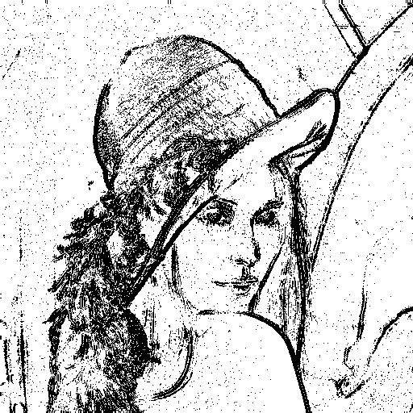

# Image Project

In this project, there are multiple functions that transform images.
Functions can be accessed using the [client](src/main/java/com/cybemos/client).

## Functions

Following functions were executed with this image as source :


### Reverse function

Arguments to give to client :
```
reverse --source path-to-source --dest path-to-dest
```

Reverse function allow to reverse color for an image.

Example of reverse :


### Blur function

Arguments to give to client :
```
blur --source path-to-source --dest path-to-dest --blurlevel blur-level
```

Blur function allow to blur an image.
The blur level can be configured to have an image more blurred.

Some example of blur :


### Shape function

Arguments to give to client :
```
shape [--unicolor] --source path-to-source --dest path-to-dest --blurlevel blur-level
```

Shape function allow to see shapes of an image.

Some example of Shape with a single color :




Some example of Shape with multiple colors :


### QuadTree function

Arguments to give to client :
```
quadtree --source path-to-source --dest path-to-dest  --deepness max-deepness
```

QuadTree function transform a source image into a [QuadTree](https://en.wikipedia.org/wiki/Quadtree).
Then re-transform it into an image to save it as a file.

Some example of QuadTree :


